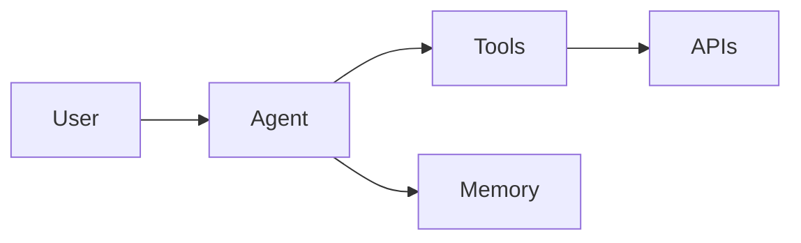

```md
---
title: AI Agent Architecture
---

# AI Agent Architecture

A conceptual design for multi-agent systems using LLMs and tool orchestration.

---

## Architecture



## Focus Areas
- Tool use
- Memory systems
- Prompt orchestration
- Agent collaboration

---

# 📝 5. BLOG (SEO ENGINE)
