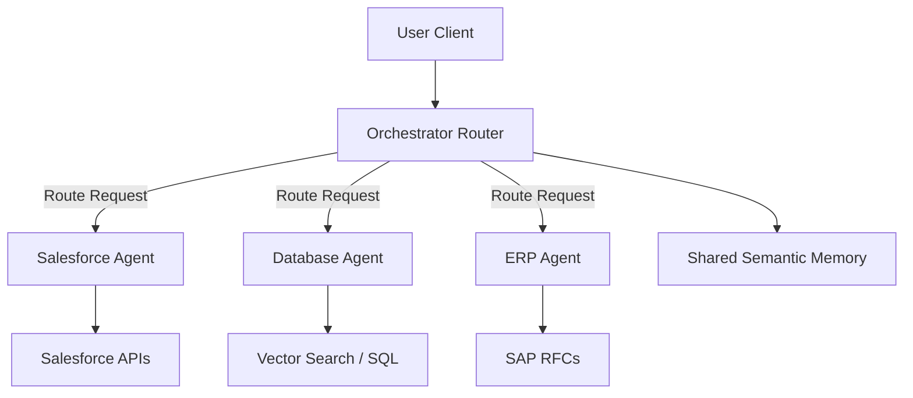

This document presents a production-ready architectural blueprint for building and orchestrating multi-agent systems inside enterprise environments. It focuses on solving key enterprise concerns: predictability, trust boundaries, cost limits, and latency optimization.

---

## 1. System Topology & Orchestration

The core pattern is a decoupled, hierarchically routed multi-agent topology. Rather than letting agents communicate freely (which leads to infinite loops and non-deterministic behavior), we implement a central **Orchestrator-Router** pattern.

```mermaid
graph TD
    User[User Client] --> Router[Orchestrator Router]
    Router --> |Route Request| SA_SF[Salesforce Agent]
    Router --> |Route Request| SA_DB[Database Agent]
    Router --> |Route Request| SA_ERP[ERP Agent]
    SA_SF --> Tools_SF[Salesforce APIs]
    SA_DB --> Tools_DB[Vector Search / SQL]
    SA_ERP --> Tools_ERP[SAP RFCs]
    Router --> Memory[Shared Semantic Memory]
```

### Key Components

1. **Orchestrator Router**: A highly specialized LLM agent (running a reasoning model like Claude 3.5 Sonnet) configured to do one thing: parse incoming intents, select the correct sub-agent, and formulate a structured execution plan.
2. **Specialized Sub-Agents**: Domain-specific agents equipped with tailored toolsets (e.g., Salesforce Agent, ERP Agent, Database Agent). Sub-agents execute narrow actions and return structured data to the router.
3. **Execution Plan**: A JSON schema representing the steps needed to fulfill the user request. This schema is validated at runtime before any sub-agents are executed.

---

## 2. Memory & State Management

Agents require context to execute multi-turn workflows. We divide memory into three distinct tiers:

| Memory Tier | Storage Backend | Purpose | Retention |
|---|---|---|---|
| **Short-Term Context** | Redis / In-Memory Session | Active conversation history (last N turns) | Session lifecycle |
| **Medium-Term State** | PostgreSQL / JSONB | Agent execution checkpoints, tool call history | Workflow lifecycle |
| **Long-Term Memory** | Supabase pgvector | Semantic history, business documentation, RAG | Permanent |

### Semantic Retrieval (RAG) Flow

To prevent prompt bloat and keep API costs minimal, we utilize an event-driven semantic memory retrieval loop:
1. **User Query**: Incoming text is converted to vector embeddings using `text-embedding-3-small`.
2. **Hybrid Search**: Query pgvector using cosine distance combined with full-text search (BM25 equivalent) to locate the top 10 most relevant documentation chunks.
3. **Re-Ranking**: Use a faster model (e.g., Claude 3.5 Haiku) to evaluate and re-rank the top 5 chunks.
4. **Context Injection**: Inject the top 5 re-ranked chunks into the Orchestrator's prompt context.

---

## 3. Tool Calling & Security Sandboxing

Sub-agents interface with enterprise data through **Tool Calling** (or Function Calling). 

> [!WARNING]
> Never allow an LLM agent to execute raw database queries or direct API mutations without validation.

### Defense-in-Depth Patterns

- **Structured Schemas**: Every tool must have a strictly defined JSON Schema (e.g., OpenAPI specification) defining input boundaries.
- **Human-in-the-Loop (HITL)**: For destructive or financial transactions (e.g., updating SAP invoice states), the execution is paused, and a webhook sends an approval request to Slack/Teams. The agent only continues once a human approves.
- **Input Sanitization**: All arguments generated by the model are parsed and checked against regular expressions (e.g., email formats, number ranges) to prevent prompt injection payloads from being executed on database layers.

---

## 4. Evaluation & Observability (LLMOps)

For enterprise trust, system performance must be measured continuously.

- **Observed Generation Spans**: Every decision (routing, tool use, re-ranking) is logged as a separate nested span in our telemetry tool (Langfuse).
- **Online Evaluation**: Background tasks automatically grade responses on a scale from 0 to 1 for correctness, tone, and security alignment.
- **CI Gate**: A regression testing suite containing 70+ deterministic and LLM-judge test cases is run on every GitHub commit.

By implementing this architecture, enterprise organizations can safely deploy agentic workflows that reduce manual overhead by up to 90% while maintaining absolute security and cost visibility.
