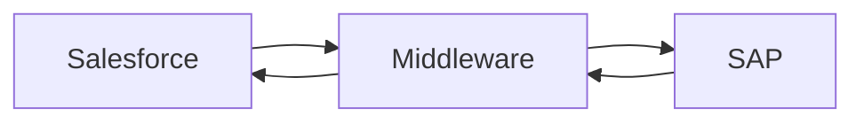

# Salesforce ↔ SAP Integration Architecture

A scalable integration pattern connecting Salesforce with SAP systems.

---

## Flow

## Key Principles
- Decoupled architecture
- Event-driven communication
- Error handling & retries
- Data consistency

---
