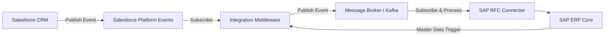
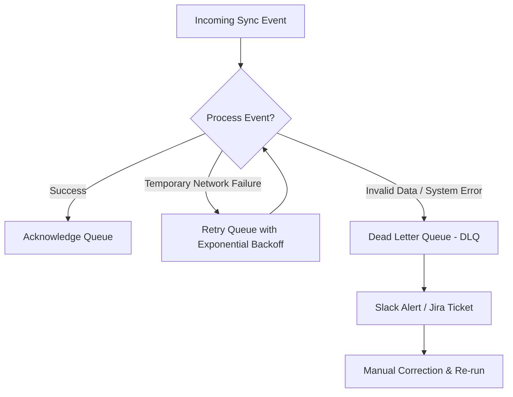

This architectural document outlines the patterns and protocols used to connect Salesforce CRM with SAP ERP. It focuses on ensuring transactional integrity, high availability, decoupled messaging, and automated error-recovery.

---

## 1. Architectural Topology & Event-Driven Patterns

Direct point-to-point connections between Salesforce and SAP create tight coupling, making the system fragile, difficult to scale, and prone to failures during system maintenance. The recommended architecture leverages an **Event-Driven Integration Layer** utilizing middleware (e.g., MuleSoft or Azure Integration Services) and a message broker (e.g., Apache Kafka or AWS EventBridge).

```mermaid
graph LR
    Salesforce[Salesforce CRM] --> |Publish Event| PlatformEvents[Salesforce Platform Events]
    PlatformEvents --> |Subscribe| Middleware[Integration Middleware]
    Middleware --> |Publish Event| Kafka[Message Broker / Kafka]
    Kafka --> |Subscribe & Process| SAP_Adapter[SAP RFC Connector]
    SAP_Adapter --> SAP[SAP ERP Core]
    SAP --> |Master Data Trigger| Middleware
```

### Strategic Patterns

- **Pub/Sub (Publish-Subscribe)**: Salesforce publishes Platform Events (e.g., `Order_Created__e`) when records change. The middleware subscribes to these events and broadcasts them to the message broker.
- **Asynchronous Fire-and-Forget**: For non-blocking processes (e.g., customer master updates, sync history), Salesforce fires the event and immediately releases resources without waiting for SAP's acknowledgement.
- **Synchronous Request-Reply (OData/RFC)**: Used only when real-time validation is strictly required (e.g., checking active inventory counts during checkout). This utilizes RESTful OData services exposed by SAP Gateway.

---

## 2. Real-Time vs. Batch Sync Matrix

Enterprise data synchronization requires balancing low latency with system resource preservation.

| Data Domain | Synchronization Type | Trigger Mechanism | Middleware Pattern | Key Concern |
|---|---|---|---|---|
| **Customer Master** | Bi-directional, Near-Real-Time | Account Save / SAP IDoc | Enterprise Service Bus (ESB) | Data deduplication & merging |
| **Inventory Status** | Synchronous Query | LWC Load / Checkout event | OData API Gateway | High concurrency & SAP resource load |
| **Order History** | Event-Driven Async | Platform Event / Change Event | Apache Kafka / Event Queue | Out-of-order execution |
| **Product Catalog** | Batch Job (Nightly) | Cron Trigger / File Transfer | ETL / Batch pipeline | Large payload volume & database locks |

---

## 3. Resilience, Error Handling, & Recovery

In a decoupled architecture, failures in target systems are inevitable. We build resilience directly into the middleware and queueing layers:

### The Recovery Pipeline

```mermaid
flowchart TD
    Event[Incoming Sync Event] --> Process{Process Event?}
    Process -->|Success| Ack[Acknowledge Queue]
    Process -->|Temporary Network Failure| Retry[Retry Queue with Exponential Backoff]
    Retry --> Process
    Process -->|Invalid Data / System Error| DLQ[Dead Letter Queue - DLQ]
    DLQ --> Alert[Slack Alert / Jira Ticket]
    Alert --> Manual[Manual Correction & Re-run]
```

1. **Exponential Backoff with Jitter**: If SAP is temporarily unreachable, the middleware retries the transaction at increasing intervals (e.g., 2s, 4s, 8s, 16s) with a randomized delay (jitter) to prevent a thundering herd problem on the ERP.
2. **Dead Letter Queue (DLQ)**: If an event fails after maximum retries (e.g., 5 attempts) or encounters a data validation error, it is moved to a Dead Letter Queue. This prevents blocking the main message stream.
3. **Circuit Breakers**: If the error rate on the SAP endpoint exceeds a defined threshold (e.g., 50% failures over 1 minute), the circuit breaker trips. The middleware immediately queues events locally and stops hitting SAP, protecting it from crashing.

---

## 4. Security & Compliance

Data exchange between CRM and ERP involves sensitive customer and financial records. Security is enforced at every layer:

- **OAuth 2.0 Mutual Authentication (mTLS)**: Handshakes between Salesforce, Middleware, and SAP require client certificates in addition to OAuth tokens.
- **IP White-listing & Virtual Private Networks (VPNs)**: SAP endpoints are restricted to middleware IP addresses. Connections are established inside a dedicated Virtual Private Cloud (VPC) linked via IPSec VPN or AWS Direct Connect.
- **Data Obfuscation**: Middleware logs are stripped of PII (Personally Identifiable Information) and payment details before being exported to log aggregators.
