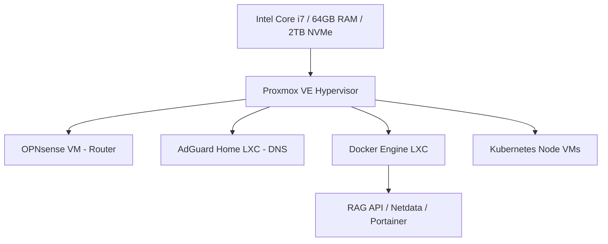

This document outlines the design and implementation of a self-hosted homelab environment. This lab serves as a secure, isolated sandbox for running DevOps pipelines, testing enterprise integrations, hosting local AI models, and practicing systems engineering.

---

## 1. Virtualization Topology (Proxmox VE)

The infrastructure core is built on **Proxmox VE** running on dedicated x86 hardware. This setup enables quick deployment of light-weight LXC containers for utility tools and full Virtual Machines (VMs) for isolated applications.



### Storage Architecture

- **Local NVMe (ZFS Mirror)**: High-speed, redundant storage pool for active VM disks and databases.
- **NFS Share (Synology NAS)**: Network storage used for nightly automated VM backups, media assets, and log archiving.

---

## 2. Network Segmentation & VLAN Structure

To ensure security, the network is segmented into isolated VLANs (Virtual Local Area Networks) managed by OPNsense. Devices in low-trust networks cannot initiate traffic to high-trust networks.

| VLAN ID | Subnet | Name | Device Types | Access Policy |
|---|---|---|---|---|
| **VLAN 10** | `10.10.10.0/24` | **Management** | Proxmox hosts, switches, OPNsense admin | Highly restricted. Accessible only via physical connection. |
| **VLAN 20** | `10.10.20.0/24` | **Trusted LAN** | Developer laptops, primary mobile devices | Allowed to access all VLANs. |
| **VLAN 30** | `10.10.30.0/24` | **R&D / Lab** | CI/CD runners, Kubernetes, Docker hosts | Allowed internet access. Isolated from Management and LAN. |
| **VLAN 40** | `10.10.40.0/24` | **IoT Network** | Smart plugs, light bulbs, Home Assistant | Outbound internet blocked. No access to other VLANs. |
| **VLAN 50** | `10.10.50.0/24` | **Guest** | Guest phones, untrusted test devices | Internet only. Isolated from all internal subnets. |

---

## 3. Firewall Policies & Security Hardening

Firewall rules are enforced at the OPNsense boundary using a **Default-Deny** posture.

```
                  ┌───────────────┐
                  │   Internet    │
                  └───────┬───────┘
                          │ (WireGuard / Cloudflare Tunnel)
                          ▼
                  ┌───────────────┐
                  │ OPNsense VM   ├─► Block All Inbound
                  └───────┬───────┘
                          │
          ┌───────────────┼───────────────┐
          ▼               ▼               ▼
     [VLAN 10]       [VLAN 30]       [VLAN 40]
    Management       R&D / Lab          IoT
  (Admin Access)   (Build Agents)  (Local Only)
```

### Key Security Implementations

* **Unbound DNS Over TLS (DoT)**: Local DNS queries are processed by AdGuard Home, which filters ads and trackers. Unresolved queries are encrypted and forwarded to Cloudflare/Quad9 using DNS over TLS (port 853) to prevent ISP eavesdropping.
* **WireGuard VPN**: Secure remote access is managed by a WireGuard server running on the firewall. This allows secure admin access to the Management VLAN from any external network without exposing open ports.
* **Reverse Proxy (Nginx Proxy Manager)**: Internal lab sites (e.g., `proxmox.lab.home`, `grafana.lab.home`) are routed through a reverse proxy using Let's Encrypt wildcard certificates. No external ports are forwarded directly to virtual machines.
* **Cloudflare Tunnels**: External-facing lab projects are securely tunneled through Cloudflare. This hides the home WAN IP and adds Cloudflare Web Application Firewall (WAF) protections, protecting endpoints from DDoS attacks.
