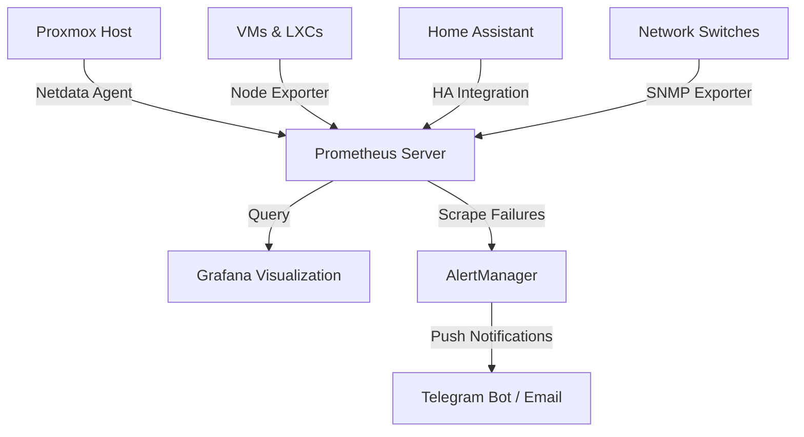

This article details the engineering behind a centralized monitoring and observability stack. The system aggregates real-time performance metrics, system logs, environmental data, and security alerts from across the homelab infrastructure into unified dashboards.

---

## 1. Observability Pipeline Architecture

Observability requires three key components: **Metrics Collection** (agents), **Storage** (time-series databases), and **Visualization** (dashboards). To keep resource utilization low on thin clients, we employ a distributed-agent design.

### Components

1. **Netdata Agents**: Installed directly on Proxmox bare-metal hosts and large VMs. Netdata collects thousands of metrics (per-second resolution) with minimal CPU overhead.
2. **Prometheus Database**: Scrapes metrics from Netdata endpoints, Node Exporters, and SNMP integrations every 15 seconds. It compresses and stores this data in a local time-series database (TSDB).
3. **Grafana**: Serves as the unified dashboard frontend, querying Prometheus to render historical graphs and alert thresholds.
4. **AlertManager**: Manages notification routing, deduplicating alerts before dispatching them to external systems.

---

## 2. Infrastructure Metrics Matrix

We classify and monitor infrastructure health across three main categories:

| Target Layer | Exporter Mechanism | Critical Metrics Monitored | Warning Thresholds |
|---|---|---|---|
| **Hypervisor (Proxmox)** | Netdata Agent | CPU IO-wait, ZFS Pool health, NVMe temperature, RAM usage | IO-wait > 15%, ZFS status != ONLINE, Temp > 65°C |
| **Containers & VMs** | Node Exporter / cAdvisor | Disk space utilization, memory leaks, service status | Disk space > 85%, Service down |
| **Network (OPNsense/Switch)** | SNMP Exporter | Port traffic throughput, packet errors, WAN bandwidth | WAN dropouts, CRC Packet errors > 0 |
| **Environmental (Server Rack)** | Home Assistant Integration | Cabinet temperature, smart plug power draw (Watts) | Rack Temp > 40°C, Power draw > 400W |

---

## 3. IoT & Environmental Telemetry (Home Assistant)

Hardware performance is directly impacted by physical conditions. A server rack enclosed in a hot cabinet will experience thermal throttling or premature drive failures. 

To bridge this gap, **Home Assistant** acts as our physical sensor gateway:
- **Zigbee Temperature Sensors**: Placed at the intake and exhaust points of the server rack. If exhaust temperature exceeds 42°C, Home Assistant activates exhaust fans and sends a warning to the alert pipeline.
- **Smart Power Telemetry**: The main UPS (Uninterruptible Power Supply) and smart plugs measure real-time power draw. Grafana tracks total energy consumption in kilowatt-hours (kWh) and estimates monthly running costs.

---

## 4. Alert Routing & Notification Rules

Dashboards are passive; critical events need active notification. We configure **AlertManager** to group and route alerts based on severity:

1. **Low Severity (Disk Space > 80%, minor packet drops)**: Queued and batched into a daily email digest.
2. **High Severity (Service Offline, RAM > 95%)**: Dispatched immediately to a private Telegram channel.
3. **Critical Severity (Rack Temp > 45°C, UPS on Battery, ZFS degraded)**: Dispatched to Telegram with a high-priority sound bypass, repeating every 5 minutes until acknowledged.
